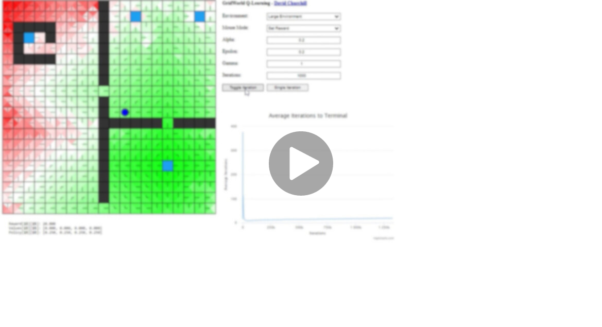

# Q-Learning - CS 3200

**Student(s):** [Mian Usama Ijaz & Farhan Atef Zoha]

Welcome to the repository showcasing my implementation of the Q-Learning assignment for Computer Science 3200. This assignment focused on optimizing decision-making in a dynamic environment using the Q-Learning algorithm.

## Video Showcase

Explore the features and functionalities of the Q-Learning assignment through the provided video. This video demonstrates the successful implementation of the Q-Learning algorithm and showcases the dynamic decision-making capabilities in action.

## Assignment Overview

In this assignment, the code was evaluated based on the following criteria. The total marks add up to 100, and deductions were made for incomplete or improperly implemented features.

### Code Style / Modularity / Readability (05 Marks)

- Consistent code indenting.
- Appropriate use of functions.
- Removal of assignment comments.
- Inclusion of student comments where explanations are necessary.

### Environment Functionality (30 Marks)

- Agent teleportation to a random location after achieving a goal (20 marks).
- Correct execution of actions by the agent using `this.getNextState` (10 marks).

### Policy Evaluation (60 Marks)

- Proper functionality of `this.selectActionFromPolicy()` (20 marks).
- Correct utilization of `this.env.getReward` (10 marks).
- Appropriate application of the Q-learning formula in `this.updateValue` (30 marks).

### Policy Update (30 Marks)

- Correct implementation of `this.updatePolicy` (30 marks).
- Program convergence to the correct policy, updated and reflected in the GUI (30 marks).

### Max Assignment Mark: 100
### Obtained Assignment Mark: 99

## Note

This repository serves as a showcase for academic purposes, and the actual code is not available due to academic regulations. The video provides a comprehensive overview of the achieved results.

If you have any questions or feedback, feel free to reach out. Thank you for exploring my Q-Learning assignment!

